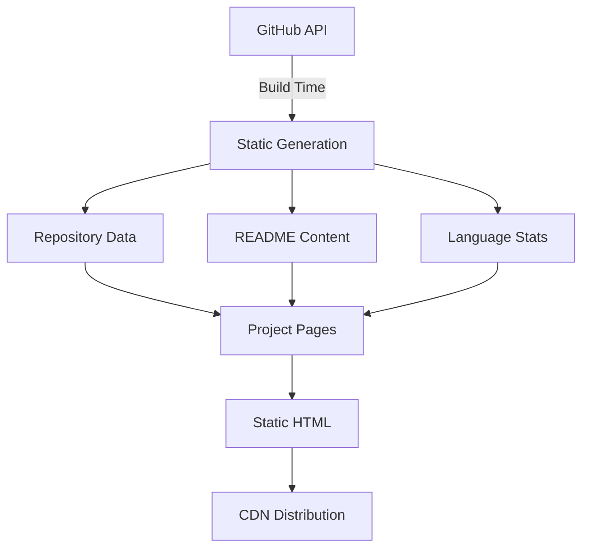
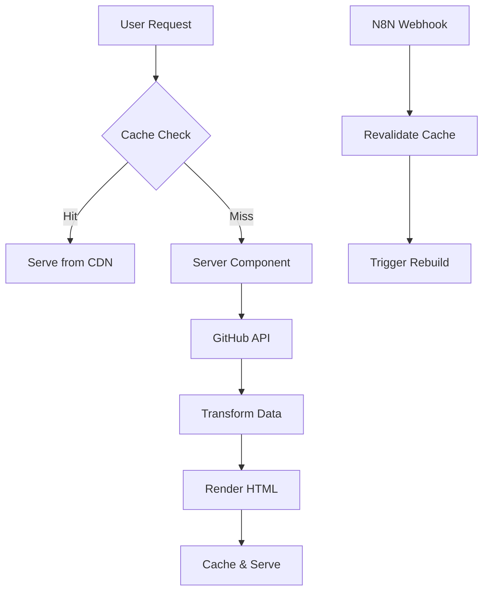
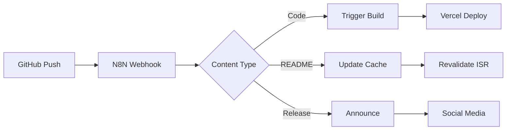

# System Architecture Design - ViSiTech Portfolio

## Executive Summary

This document outlines the complete system architecture for Vicente Rivas Monferrer's professional developer portfolio. The architecture is designed to create a high-performance, auto-updating portfolio that showcases 33+ GitHub repositories, emphasizes leadership experience, and demonstrates technical progression from student to professional developer.

The system leverages Next.js 14's App Router for optimal performance through Server Components, static generation with ISR, and edge runtime capabilities. The architecture prioritizes developer experience, maintainability, and extensibility while achieving Lighthouse scores >90 across all metrics.

---

## 1. Tech Stack Decisions

### Core Technologies

| Technology | Choice | Version | Rationale |
|------------|--------|---------|-----------|
| **Framework** | Next.js | 14.2.x | App Router for RSC, optimal SEO through SSG/ISR, built-in optimizations, edge runtime support |
| **Language** | TypeScript | 5.3.x | Type safety, enhanced DX, better refactoring, self-documenting code |
| **Styling** | Tailwind CSS | 3.4.x | Utility-first for rapid development, JIT compilation, minimal bundle size |
| **UI Library** | shadcn/ui | Latest | Radix UI primitives, copy-paste components, full customization control |
| **State Management** | Zustand | 4.5.x | Lightweight (8KB), TypeScript-first, no providers needed |
| **Data Fetching** | TanStack Query | 5.x | Powerful caching, background refetching, optimistic updates |
| **Animation** | Framer Motion | 11.x | Declarative animations, gesture support, layout animations |
| **Icons** | Lucide React | Latest | Tree-shakeable, consistent design, TypeScript support |
| **Forms** | React Hook Form + Zod | Latest | Performance, validation, TypeScript schemas |
| **Markdown** | MDX | 3.x | Component embedding, syntax highlighting, frontmatter support |
| **Testing** | Vitest + Playwright | Latest | Fast unit tests, E2E coverage, component testing |
| **Analytics** | Vercel Analytics | Latest | Core Web Vitals, real user monitoring |

### Infrastructure & DevOps

| Technology | Choice | Rationale |
|------------|--------|-----------|
| **Deployment** | Vercel | Zero-config Next.js deployment, edge functions, analytics |
| **CI/CD** | GitHub Actions | Native GitHub integration, matrix builds, secrets management |
| **Monitoring** | Sentry | Error tracking, performance monitoring, release tracking |
| **CDN** | Vercel Edge Network | Global distribution, automatic optimization |
| **Database** | Vercel KV (Redis) | Optional for view counts, caching layer |
| **Automation** | N8N | Visual workflows, GitHub webhook integration |

---

## 2. Folder Structure

```
visitech-portfolio/
├── .claude/                     # Agent workspace
│   ├── doc/
│   │   ├── architecture/       # Architecture documentation
│   │   ├── frontend/           # Frontend specifications
│   │   ├── backend/            # Backend specifications
│   │   ├── ui-ux/              # Design specifications
│   │   ├── devops/             # DevOps configurations
│   │   └── n8n/                # Automation workflows
│   └── sessions/               # Session context
│
├── app/                         # Next.js 14 App Router
│   ├── (marketing)/            # Marketing pages group
│   │   ├── page.tsx            # Homepage
│   │   ├── about/
│   │   │   └── page.tsx        # About page
│   │   └── contact/
│   │       └── page.tsx        # Contact page
│   │
│   ├── projects/               # Projects section
│   │   ├── page.tsx            # Projects listing
│   │   ├── [slug]/
│   │   │   ├── page.tsx        # Project detail
│   │   │   └── loading.tsx     # Loading state
│   │   └── layout.tsx          # Projects layout
│   │
│   ├── blog/                   # Blog section (Phase 2)
│   │   ├── page.tsx            # Blog listing
│   │   └── [slug]/
│   │       └── page.tsx        # Blog post
│   │
│   ├── api/                    # API Routes
│   │   ├── github/
│   │   │   ├── repos/route.ts  # Fetch repositories
│   │   │   ├── readme/route.ts # Fetch README
│   │   │   └── stats/route.ts  # GitHub statistics
│   │   ├── revalidate/route.ts # ISR revalidation webhook
│   │   └── contact/route.ts    # Contact form handler
│   │
│   ├── layout.tsx              # Root layout
│   ├── globals.css             # Global styles
│   ├── not-found.tsx           # 404 page
│   ├── error.tsx               # Error boundary
│   ├── loading.tsx             # Global loading
│   ├── sitemap.ts              # Dynamic sitemap
│   ├── robots.ts               # Dynamic robots.txt
│   └── manifest.ts             # PWA manifest
│
├── components/                  # Component Library
│   ├── ui/                     # shadcn/ui components
│   │   ├── button.tsx
│   │   ├── card.tsx
│   │   ├── dialog.tsx
│   │   ├── dropdown-menu.tsx
│   │   ├── navigation-menu.tsx
│   │   ├── scroll-area.tsx
│   │   ├── separator.tsx
│   │   ├── sheet.tsx
│   │   ├── skeleton.tsx
│   │   ├── tabs.tsx
│   │   ├── tooltip.tsx
│   │   └── ...
│   │
│   ├── layout/                 # Layout components
│   │   ├── Header.tsx          # Main header
│   │   ├── Navigation.tsx      # Navigation menu
│   │   ├── Footer.tsx          # Footer
│   │   ├── MobileNav.tsx       # Mobile navigation
│   │   ├── ThemeToggle.tsx     # Dark mode toggle
│   │   └── ScrollToTop.tsx     # Scroll to top button
│   │
│   ├── home/                   # Homepage components
│   │   ├── Hero.tsx            # Hero section
│   │   ├── FeaturedProjects.tsx # Featured projects grid
│   │   ├── TechStack.tsx       # Technology showcase
│   │   ├── Timeline.tsx        # Career timeline
│   │   ├── Achievements.tsx    # Awards & achievements
│   │   └── CallToAction.tsx    # Contact CTA
│   │
│   ├── projects/               # Projects components
│   │   ├── ProjectCard.tsx     # Project card
│   │   ├── ProjectGrid.tsx     # Projects grid
│   │   ├── ProjectFilters.tsx  # Filter controls
│   │   ├── ProjectSearch.tsx   # Search bar
│   │   ├── ProjectDetail.tsx   # Full project view
│   │   ├── ProjectStats.tsx    # GitHub statistics
│   │   ├── TechBadge.tsx       # Technology badge
│   │   └── ReadmeViewer.tsx    # Markdown renderer
│   │
│   ├── about/                  # About page components
│   │   ├── Biography.tsx       # Extended bio
│   │   ├── Skills.tsx          # Skills matrix
│   │   ├── Education.tsx       # Education timeline
│   │   ├── Languages.tsx       # Language proficiency
│   │   └── Interests.tsx       # Personal interests
│   │
│   ├── shared/                 # Shared components
│   │   ├── AnimatedSection.tsx # Scroll animations
│   │   ├── GradientText.tsx    # Gradient text effect
│   │   ├── ParallaxImage.tsx   # Parallax images
│   │   ├── TypeWriter.tsx      # Typewriter effect
│   │   ├── LoadingSpinner.tsx  # Loading indicator
│   │   ├── ErrorBoundary.tsx   # Error handling
│   │   └── SEO.tsx            # SEO metadata
│   │
│   └── providers/              # Context providers
│       ├── ThemeProvider.tsx   # Dark mode provider
│       ├── QueryProvider.tsx   # TanStack Query
│       └── AnalyticsProvider.tsx # Analytics
│
├── lib/                        # Core libraries
│   ├── github/                 # GitHub integration
│   │   ├── client.ts          # GitHub API client
│   │   ├── types.ts           # TypeScript types
│   │   ├── queries.ts         # API queries
│   │   ├── transforms.ts      # Data transformations
│   │   └── cache.ts           # Caching strategy
│   │
│   ├── utils/                  # Utilities
│   │   ├── cn.ts              # className helper
│   │   ├── formatting.ts      # Date/string formatting
│   │   ├── seo.ts            # SEO utilities
│   │   ├── performance.ts     # Performance helpers
│   │   └── validation.ts      # Validation schemas
│   │
│   ├── hooks/                  # Custom hooks
│   │   ├── useGitHub.ts       # GitHub data hook
│   │   ├── useIntersection.ts # Intersection observer
│   │   ├── useMediaQuery.ts   # Responsive hook
│   │   ├── useScrollProgress.ts # Scroll progress
│   │   └── useDebounce.ts     # Debounce hook
│   │
│   ├── constants/              # Constants
│   │   ├── projects.ts        # Project metadata
│   │   ├── navigation.ts      # Nav links
│   │   ├── skills.ts          # Skills data
│   │   └── social.ts          # Social links
│   │
│   └── types/                  # TypeScript definitions
│       ├── github.ts          # GitHub types
│       ├── project.ts         # Project types
│       ├── api.ts             # API types
│       └── global.d.ts        # Global types
│
├── public/                     # Static assets
│   ├── images/
│   │   ├── profile/           # Profile images
│   │   ├── projects/          # Project screenshots
│   │   └── og/                # Open Graph images
│   ├── fonts/                 # Custom fonts
│   ├── resume.pdf             # Downloadable resume
│   └── favicon/               # Favicon set
│
├── styles/                     # Additional styles
│   ├── globals.css            # Global styles
│   └── markdown.css           # Markdown styling
│
├── scripts/                    # Build scripts
│   ├── generate-og.ts         # OG image generation
│   ├── analyze-bundle.ts      # Bundle analysis
│   └── validate-links.ts      # Link validation
│
├── tests/                      # Test suites
│   ├── unit/                  # Unit tests
│   ├── integration/           # Integration tests
│   └── e2e/                   # E2E tests
│
├── .github/                    # GitHub configuration
│   ├── workflows/             # CI/CD pipelines
│   └── dependabot.yml         # Dependency updates
│
├── .env.example               # Environment template
├── .eslintrc.json            # ESLint config
├── .prettierrc               # Prettier config
├── next.config.mjs           # Next.js config
├── tailwind.config.ts        # Tailwind config
├── tsconfig.json             # TypeScript config
├── package.json              # Dependencies
└── README.md                 # Project documentation
```

---

## 3. Data Flow Architecture

### 3.1 Build-Time Data Flow



### 3.2 Runtime Data Flow



### 3.3 Data Transformation Pipeline

```typescript
// Data flow stages
1. Fetch: GitHub API → Raw Data
2. Transform: Raw Data → Normalized Schema
3. Enrich: Add metadata, categories, computed fields
4. Filter: Apply visibility rules, featured flags
5. Sort: Chronological, popularity, category
6. Cache: Store in Vercel KV with TTL
7. Serve: Return optimized payload
```

---

## 4. Component Hierarchy

### 4.1 Page Component Tree

```
RootLayout
├── ThemeProvider
├── QueryProvider
├── AnalyticsProvider
└── children
    ├── Header
    │   ├── Logo
    │   ├── Navigation
    │   ├── ThemeToggle
    │   └── MobileMenu
    ├── Main (Page Content)
    │   └── [Dynamic Page Components]
    └── Footer
        ├── SocialLinks
        ├── QuickLinks
        └── Copyright
```

### 4.2 Homepage Component Composition

```
HomePage
├── Hero
│   ├── AnimatedTitle
│   ├── TypewriterSubtitle
│   ├── CTAButtons
│   └── ScrollIndicator
├── FeaturedProjects
│   ├── SectionHeader
│   ├── ProjectGrid
│   │   └── ProjectCard (x3-6)
│   └── ViewAllLink
├── TechStack
│   ├── SectionHeader
│   ├── TechCategories
│   │   ├── Languages
│   │   ├── Frameworks
│   │   ├── Tools
│   │   └── Cloud
│   └── SkillBars
├── Timeline
│   ├── SectionHeader
│   ├── TimelineItems
│   │   ├── Education
│   │   ├── Projects
│   │   └── Achievements
│   └── CurrentFocus
└── CallToAction
    ├── ContactForm
    └── SocialLinks
```

### 4.3 Project Detail Component Structure

```
ProjectDetailPage
├── ProjectHeader
│   ├── Title
│   ├── Description
│   ├── Metadata (date, role, status)
│   └── CTAButtons (GitHub, Demo)
├── ProjectHero
│   ├── Screenshot/Video
│   └── TechStack
├── ProjectContent
│   ├── ReadmeViewer
│   ├── Features
│   ├── Challenges
│   └── Impact
├── ProjectStats
│   ├── GitHubStats
│   ├── Contributors
│   └── Activity
└── RelatedProjects
    └── ProjectCard (x3)
```

---

## 5. API Integration Strategy

### 5.1 GitHub API Integration

```typescript
// API Endpoints Usage
interface GitHubAPIStrategy {
  // Public repositories
  repositories: {
    endpoint: '/users/vjrivmon/repos',
    method: 'GET',
    cache: 'force-cache',
    revalidate: 3600, // 1 hour
    transform: normalizeRepository
  },

  // Repository details
  repository: {
    endpoint: '/repos/vjrivmon/{repo}',
    method: 'GET',
    cache: 'force-cache',
    revalidate: 3600,
    transform: enrichRepository
  },

  // README content
  readme: {
    endpoint: '/repos/vjrivmon/{repo}/readme',
    method: 'GET',
    cache: 'force-cache',
    revalidate: 86400, // 24 hours
    transform: parseMarkdown
  },

  // Language statistics
  languages: {
    endpoint: '/repos/vjrivmon/{repo}/languages',
    method: 'GET',
    cache: 'force-cache',
    revalidate: 604800, // 1 week
    transform: calculatePercentages
  }
}
```

### 5.2 Data Fetching Strategy

```typescript
// Server Component Data Fetching
async function getProjectData(slug: string) {
  // Parallel fetching for optimal performance
  const [repo, readme, languages] = await Promise.all([
    fetchRepository(slug),
    fetchReadme(slug),
    fetchLanguages(slug)
  ]);

  return {
    ...repo,
    readme,
    languages,
    // Computed fields
    category: categorizeProject(repo),
    featured: isFeatured(repo),
    techStack: extractTechStack(repo, readme)
  };
}
```

### 5.3 Caching Strategy

| Data Type | Cache Duration | Revalidation |
|-----------|---------------|--------------|
| Repository List | 1 hour | ISR + Webhook |
| Repository Details | 1 hour | ISR + Webhook |
| README Content | 24 hours | On-demand |
| Language Stats | 1 week | Build-time |
| User Profile | 1 week | Build-time |
| Static Assets | Forever | Immutable |

---

## 6. Performance Optimization Plan

### 6.1 Build-Time Optimizations

- **Static Generation**: All pages pre-rendered at build time
- **ISR Configuration**: Revalidate key pages every hour
- **Image Optimization**: Next.js Image with blur placeholders
- **Font Optimization**: Variable fonts with font-display: swap
- **Code Splitting**: Dynamic imports for heavy components
- **Tree Shaking**: Remove unused code automatically
- **CSS Optimization**: Tailwind JIT with purge

### 6.2 Runtime Optimizations

```typescript
// Performance strategies
const optimizations = {
  // Lazy loading
  lazyLoad: ['ProjectGrid', 'Timeline', 'Achievements'],

  // Prefetching
  prefetch: ['projects', 'about'],

  // Image loading
  images: {
    priority: ['hero', 'featured-projects'],
    lazy: ['timeline', 'achievements'],
    placeholder: 'blur'
  },

  // Bundle optimization
  bundle: {
    splitChunks: true,
    minify: true,
    compress: 'gzip'
  }
};
```

### 6.3 Performance Metrics Targets

| Metric | Target | Critical |
|--------|--------|----------|
| Lighthouse Performance | > 95 | > 90 |
| Lighthouse Accessibility | > 98 | > 95 |
| Lighthouse SEO | 100 | > 95 |
| First Contentful Paint | < 1.2s | < 1.5s |
| Largest Contentful Paint | < 2.0s | < 2.5s |
| Time to Interactive | < 3.0s | < 3.5s |
| Cumulative Layout Shift | < 0.05 | < 0.1 |
| First Input Delay | < 50ms | < 100ms |
| Bundle Size (gzipped) | < 250KB | < 300KB |

---

## 7. SEO & Metadata Strategy

### 7.1 Metadata Implementation

```typescript
// Page-level metadata
export const metadata: Metadata = {
  title: {
    template: '%s | Vicente Rivas - Developer Portfolio',
    default: 'Vicente Rivas - Backend Developer & Scrum Master'
  },
  description: 'Portfolio of Vicente Rivas Monferrer...',
  keywords: ['developer', 'backend', 'scrum master', ...],
  authors: [{ name: 'Vicente Rivas Monferrer' }],
  creator: 'Vicente Rivas Monferrer',

  // Open Graph
  openGraph: {
    type: 'website',
    locale: 'es_ES',
    alternateLocale: 'en_US',
    url: 'https://vicentrivas.dev',
    siteName: 'Vicente Rivas Portfolio',
    images: ['/og-image.jpg']
  },

  // Twitter Card
  twitter: {
    card: 'summary_large_image',
    site: '@vjrivmon'
  },

  // Verification
  verification: {
    google: 'google-site-verification-code'
  }
};
```

### 7.2 Structured Data (JSON-LD)

```typescript
// Person schema for About page
const personSchema = {
  '@context': 'https://schema.org',
  '@type': 'Person',
  name: 'Vicente Rivas Monferrer',
  jobTitle: 'Backend Developer',
  alumniOf: 'Universidad Politécnica de Valencia',
  knowsAbout: ['Software Development', 'ROS2', 'DevOps'],
  sameAs: [
    'https://linkedin.com/in/vicente-rivas-monferrer',
    'https://github.com/vjrivmon'
  ]
};
```

### 7.3 Technical SEO

- Dynamic sitemap generation
- Robots.txt configuration
- Canonical URLs
- Hreflang tags for multilingual support
- Meta descriptions for all pages
- Alt text for all images
- Semantic HTML structure
- Schema.org markup

---

## 8. Dark Mode Implementation

### 8.1 Theme Strategy

```typescript
// Theme configuration
const themeConfig = {
  // CSS Variables approach
  colors: {
    light: {
      background: 'hsl(0 0% 100%)',
      foreground: 'hsl(222.2 84% 4.9%)',
      primary: 'hsl(221.2 83.2% 53.3%)',
      secondary: 'hsl(210 40% 96.1%)'
    },
    dark: {
      background: 'hsl(222.2 84% 4.9%)',
      foreground: 'hsl(210 40% 98%)',
      primary: 'hsl(217.2 91.2% 59.8%)',
      secondary: 'hsl(217.2 32.6% 17.5%)'
    }
  },

  // Storage
  storage: 'localStorage',
  key: 'visitech-theme',

  // System preference
  respectSystemPreference: true
};
```

### 8.2 Implementation Approach

1. CSS Variables for colors
2. Tailwind dark: prefix
3. next-themes for SSR-safe theming
4. System preference detection
5. Smooth transitions
6. Persistent user choice

---

## 9. Responsive Design Strategy

### 9.1 Breakpoint System

```typescript
// Tailwind breakpoints
const breakpoints = {
  'sm': '640px',   // Mobile landscape
  'md': '768px',   // Tablet
  'lg': '1024px',  // Desktop
  'xl': '1280px',  // Large desktop
  '2xl': '1536px'  // Ultra-wide
};
```

### 9.2 Mobile-First Approach

- Base styles for mobile
- Progressive enhancement for larger screens
- Touch-optimized interactions
- Responsive typography (clamp)
- Flexible grid systems
- Adaptive images

### 9.3 Component Responsiveness

| Component | Mobile | Tablet | Desktop |
|-----------|--------|--------|---------|
| Navigation | Hamburger | Hamburger | Full menu |
| Project Grid | 1 column | 2 columns | 3-4 columns |
| Hero | Stacked | Stacked | Side-by-side |
| Timeline | Vertical | Vertical | Alternating |
| Tech Stack | List | Grid 2x | Grid 3x |

---

## 10. Development Workflow

### 10.1 Development Process

```bash
# Development workflow
1. Feature branch from main
2. Implement with hot reload
3. Unit & integration tests
4. Lighthouse audit
5. PR with preview deployment
6. Code review
7. Merge to main
8. Auto-deploy to production
```

### 10.2 Build Process

```typescript
// next.config.mjs optimizations
const config = {
  // Compiler options
  compiler: {
    removeConsole: process.env.NODE_ENV === 'production'
  },

  // Image optimization
  images: {
    formats: ['image/avif', 'image/webp'],
    domains: ['github.com', 'raw.githubusercontent.com']
  },

  // Bundle analysis
  webpack: (config, { isServer }) => {
    if (!isServer) {
      config.resolve.alias = {
        ...config.resolve.alias,
        '@': path.resolve(__dirname, './')
      };
    }
    return config;
  }
};
```

### 10.3 CI/CD Pipeline

```yaml
# GitHub Actions workflow
name: CI/CD Pipeline
on:
  push:
    branches: [main]
  pull_request:
    branches: [main]

jobs:
  test:
    - TypeScript check
    - ESLint
    - Unit tests
    - Integration tests

  build:
    - Next.js build
    - Bundle analysis
    - Lighthouse CI

  deploy:
    - Vercel deployment
    - E2E tests
    - Performance monitoring
```

---

## 11. Dependencies List

### 11.1 Core Dependencies

```json
{
  "dependencies": {
    // Framework
    "next": "^14.2.0",
    "react": "^18.3.0",
    "react-dom": "^18.3.0",

    // TypeScript
    "typescript": "^5.3.0",

    // Styling
    "tailwindcss": "^3.4.0",
    "autoprefixer": "^10.4.0",
    "postcss": "^8.4.0",
    "@tailwindcss/typography": "^0.5.0",

    // UI Components
    "@radix-ui/react-*": "latest",
    "class-variance-authority": "^0.7.0",
    "clsx": "^2.1.0",
    "tailwind-merge": "^2.2.0",

    // State & Data
    "zustand": "^4.5.0",
    "@tanstack/react-query": "^5.0.0",
    "axios": "^1.6.0",

    // Animation
    "framer-motion": "^11.0.0",

    // Icons
    "lucide-react": "^0.300.0",

    // Forms
    "react-hook-form": "^7.48.0",
    "zod": "^3.22.0",
    "@hookform/resolvers": "^3.3.0",

    // Markdown
    "@mdx-js/loader": "^3.0.0",
    "@mdx-js/react": "^3.0.0",
    "remark": "^15.0.0",
    "rehype": "^13.0.0",

    // Theme
    "next-themes": "^0.2.0",

    // Analytics
    "@vercel/analytics": "^1.1.0",
    "@vercel/speed-insights": "^1.0.0",

    // SEO
    "next-seo": "^6.4.0",

    // Utilities
    "date-fns": "^3.0.0",
    "sharp": "^0.33.0"
  },

  "devDependencies": {
    // Types
    "@types/node": "^20.10.0",
    "@types/react": "^18.2.0",
    "@types/react-dom": "^18.2.0",

    // Linting
    "eslint": "^8.56.0",
    "eslint-config-next": "^14.2.0",
    "@typescript-eslint/eslint-plugin": "^6.0.0",
    "@typescript-eslint/parser": "^6.0.0",

    // Formatting
    "prettier": "^3.2.0",
    "prettier-plugin-tailwindcss": "^0.5.0",

    // Testing
    "vitest": "^1.2.0",
    "@testing-library/react": "^14.1.0",
    "@playwright/test": "^1.40.0",

    // Tools
    "@next/bundle-analyzer": "^14.2.0",
    "cross-env": "^7.0.0"
  }
}
```

---

## 12. Environment Variables

```bash
# .env.local
# GitHub API
GITHUB_TOKEN=ghp_xxxxxxxxxxxx
GITHUB_USERNAME=vjrivmon

# Vercel
VERCEL_URL=https://vicentrivas.dev
REVALIDATE_TOKEN=secret_webhook_token

# Analytics
NEXT_PUBLIC_GA_ID=G-XXXXXXXXXX
SENTRY_DSN=https://xxx@sentry.io/xxx

# Contact Form
SMTP_HOST=smtp.gmail.com
SMTP_PORT=587
SMTP_USER=vicenterivasmonferrer12@gmail.com
SMTP_PASS=xxxxxxxxxxxx

# Optional: Database
KV_URL=redis://xxx
KV_TOKEN=xxx

# N8N Webhook
N8N_WEBHOOK_URL=https://n8n.domain.com/webhook/xxx
```

---

## 13. Success Metrics

### 13.1 Technical Metrics

| Metric | Target | Measurement |
|--------|--------|-------------|
| Build Success | 100% | CI/CD pipeline |
| Test Coverage | > 80% | Vitest coverage |
| Type Coverage | 100% | TypeScript strict |
| Lighthouse Score | > 90 | Lighthouse CI |
| Bundle Size | < 300KB | Webpack analyzer |
| Load Time | < 3s | Web Vitals |
| SEO Score | 100 | Lighthouse SEO |
| Accessibility | > 95 | Lighthouse A11y |

### 13.2 Business Metrics

| Metric | Target | Measurement |
|--------|--------|-------------|
| Portfolio Completeness | 100% | All 33 repos shown |
| Project Documentation | 100% | All featured with README |
| Contact Rate | > 5% | Form submissions |
| Page Views | > 1000/month | Analytics |
| Session Duration | > 2 min | Analytics |
| Bounce Rate | < 40% | Analytics |
| Mobile Usage | > 50% | Analytics |

### 13.3 Development Metrics

| Metric | Target | Measurement |
|--------|--------|-------------|
| Development Time | 6-8 hours | Time tracking |
| Feature Completion | 100% | Requirements met |
| Bug Rate | < 5 | Post-launch issues |
| Performance Regressions | 0 | CI monitoring |
| Security Issues | 0 | Security audit |

---

## 14. Integration Points

### 14.1 External Services

```typescript
// Service integrations
const integrations = {
  github: {
    api: 'https://api.github.com',
    auth: 'Bearer token',
    rateLimit: '5000/hour'
  },

  vercel: {
    deployment: 'Auto on push',
    preview: 'PR deployments',
    analytics: 'Built-in'
  },

  n8n: {
    webhook: 'Repository updates',
    schedule: 'Weekly reports',
    notifications: 'Error alerts'
  },

  monitoring: {
    sentry: 'Error tracking',
    analytics: 'User behavior',
    speedInsights: 'Performance'
  }
};
```

### 14.2 Automation Workflows



---

## 15. Security Considerations

### 15.1 Security Measures

- Environment variables for sensitive data
- API rate limiting implementation
- Input validation with Zod schemas
- XSS protection via React
- CSRF tokens for forms
- Content Security Policy headers
- Secure headers configuration
- Regular dependency updates

### 15.2 API Security

```typescript
// API route protection
export async function POST(request: Request) {
  // Rate limiting
  const ip = request.headers.get('x-forwarded-for');
  if (await isRateLimited(ip)) {
    return new Response('Too Many Requests', { status: 429 });
  }

  // Token validation
  const token = request.headers.get('authorization');
  if (!isValidToken(token)) {
    return new Response('Unauthorized', { status: 401 });
  }

  // Input validation
  const body = await request.json();
  const validated = schema.parse(body);

  // Process request...
}
```

---

## 16. Scalability Plan

### 16.1 Current Architecture (MVP)

- Static generation for all content
- ISR for dynamic updates
- Edge caching via Vercel
- Client-side state management
- Optimistic UI updates

### 16.2 Future Scalability (Growth Phase)

```typescript
// Scalability roadmap
const scalabilityPlan = {
  phase1: {
    name: 'MVP',
    users: '< 1K/month',
    architecture: 'SSG + ISR'
  },

  phase2: {
    name: 'Growth',
    users: '1K-10K/month',
    additions: [
      'Redis caching layer',
      'CDN optimization',
      'Database for analytics'
    ]
  },

  phase3: {
    name: 'Scale',
    users: '> 10K/month',
    additions: [
      'Microservices split',
      'GraphQL API',
      'Real-time features',
      'Multi-region deployment'
    ]
  }
};
```

### 16.3 Database Strategy (Optional)

```typescript
// Future database schema
interface DatabaseSchema {
  projects: {
    id: string;
    github_id: number;
    metadata: JsonValue;
    views: number;
    likes: number;
  };

  analytics: {
    id: string;
    event: string;
    timestamp: Date;
    metadata: JsonValue;
  };

  messages: {
    id: string;
    email: string;
    message: string;
    timestamp: Date;
  };
}
```

---

## Conclusion

This architecture provides a solid foundation for Vicente Rivas Monferrer's developer portfolio. The design prioritizes:

1. **Performance**: Through SSG, ISR, and edge caching
2. **Developer Experience**: TypeScript, modern tooling, clear structure
3. **Maintainability**: Modular components, clear separation of concerns
4. **Scalability**: Ready for growth with optional enhancements
5. **SEO**: Comprehensive optimization for discoverability
6. **User Experience**: Fast, responsive, accessible interface

The architecture is designed to be implemented in phases, with the MVP focusing on core features and performance, while maintaining flexibility for future enhancements.

---

**Document Version**: 1.0.0
**Created**: 2025-10-01
**Author**: System Architect Agent
**Project**: ViSiTech Portfolio