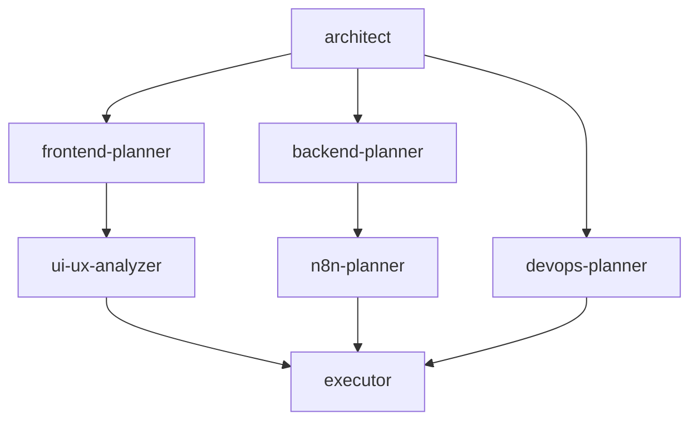

# 🚀 Portfolio Build - Multi-Agent System Initialization

## 📋 Tabla de Contenidos

- [Contexto](#contexto)
- [Perfil del Desarrollador](#perfil-del-desarrollador)
- [Proyectos Destacados](#proyectos-destacados)
- [Habilidades Técnicas](#habilidades-técnicas)
- [Declaración de Misión](#declaración-de-misión)
- [Requisitos Técnicos](#requisitos-técnicos)
- [Arquitectura Multi-Agente](#arquitectura-multi-agente)
- [Protocolo de Comunicación](#protocolo-de-comunicación)
- [MCPs Disponibles](#mcps-disponibles)
- [Configuración GitHub](#configuración-github)
- [Criterios de Éxito](#criterios-de-éxito)
- [Acciones Iniciales del Coordinador](#acciones-iniciales-del-coordinador)
- [Reglas Críticas](#reglas-críticas)
- [Manejo de Errores](#manejo-de-errores)
- [Timeline Esperado](#timeline-esperado)

---

## 🎯 Contexto

Estás inicializando un **sistema multi-agente** para construir un portafolio profesional de desarrollador para **Vicente Rivas Monferrer** ([@vjrivmon](https://github.com/vjrivmon)).

Este es un sistema de **AUTOMATIZACIÓN COMPLETO** donde agentes especialistas planifican y **UN ejecutor** implementa.

---

## 👤 Perfil del Desarrollador

### 📁 Fuente de Datos

```
Leer desde: .claude/sessions/developer_profile.json
```

### 📌 Información Personal

| Campo | Valor |
|-------|-------|
| **Nombre** | Vicente Rivas Monferrer |
| **Título** | Backend Developer, Software Developer, Scrum Master |
| **GitHub** | [github.com/vjrivmon](https://github.com/vjrivmon) |
| **Ubicación** | Bétera, Valencia, España |
| **Email** | vicenterivasmonferrer12@gmail.com |
| **LinkedIn** | [Vicente Rivas Monferrer](https://www.linkedin.com/in/vicente-rivas-monferrer) |

### 🎓 Estado Actual

- **Educación**: Grado en Tecnologías Interactivas (UPV) - Último año
- **Bootcamp**: DevOps (Código Facilito) - 2024-2025
- **Trabajando en**: AidGuide - Guía robótica para personas con discapacidad visual

### 💬 Bio

> "Soy un joven estudiante de último año que me apasiona el mundo de las tecnologías software. Me adapto a cualquier entorno de desarrollo y soy capaz de sacar la mejor versión de mí colaborando y liderando un equipo de trabajo."

### 💡 Lema

> "If the plan doesn't work, change the plan, but don't change the goal."

---

## 🌟 Proyectos Destacados

### 1. 🤖 **AidGuide** - `ACTIVO` - `DESTACADO`

- **Tipo**: Robótica + AI
- **Rol**: Scrum Master
- **Período**: Enero 2025 - Actualidad
- **Descripción**: Asistente robótico para personas con movilidad reducida usando TurtleBot3
- **Tecnologías**: Linux, Python, ROS2, Raspberry Pi, Gazebo, AI
- **GitHub**: [aidguide_04](https://github.com/vjrivmon/aidguide_04) ⭐ 3
- **Estado**: Desarrollo activo
- **Impacto**: Creando un entorno más seguro e inclusivo

### 2. 🌍 **VIMYP** - `DESTACADO`

- **Tipo**: Medioambiente + IoT
- **Rol**: Team Leader
- **Período**: Septiembre 2024 - Enero 2025
- **Descripción**: APP/WEB de mapa interactivo sobre calidad del aire
- **Tecnologías**: Android, Arduino, Web, SQL, IoT

### 3. 🎮 **PoliGames** - `DESTACADO`

- **Tipo**: Videojuegos 3D
- **Rol**: Team Leader
- **Período**: Febrero 2024 - Junio 2024
- **Descripción**: Videojuego 3D con modelado completo
- **Tecnologías**: Unity, 3DS Max, Blender, C#, Substance Painter

### 4. 💡 **ECOCITY**

- **Tipo**: Internet de las Cosas
- **Rol**: Backend Programmer
- **Descripción**: Farola inteligente con sensores
- **Tecnologías**: Android, Java, Arduino, Firebase, Raspberry Pi
- **GitHub**: [IoT_Farola_](https://github.com/vjrivmon/IoT_Farola_)

### 5. 🌱 **PoliHuerto** (2 versiones)

- **Versión Web**: HTML, CSS, JavaScript, SQL, PHP
- **Versión CDIO**: Arduino, C++, IoT

---

## 🛠️ Habilidades Técnicas

### 💻 Lenguajes de Programación

#### Backend
`Python` • `JavaScript` • `TypeScript` • `Node.js` • `C++` • `C#` • `Java` • `PHP`

#### Scripting
`Bash` • `SQL`

#### Markup
`HTML` • `CSS`

### 🔧 Frameworks y Herramientas

| Categoría | Tecnologías |
|-----------|-------------|
| **DevOps** | Docker, Git, GitHub, CI/CD, AWS |
| **Robótica** | ROS2, Gazebo |
| **IoT** | Arduino, Raspberry Pi |
| **Game Dev** | Unity, 3DS Max, Blender |
| **Bases de Datos** | SQL, Firebase, MariaDB, PostgreSQL |
| **Otros** | Trello, Figma, NumPy, Visual Studio Code |

### 🤝 Soft Skills

- ✅ Trabajo en Equipo
- ✅ SCRUM/CDIO Methodologies
- ✅ Liderazgo (múltiples roles como Team Leader)
- ✅ Creatividad
- ✅ Resolución de problemas
- ✅ Resiliencia y Compromiso

### 🌐 Idiomas

| Idioma | Nivel |
|--------|-------|
| Español | Nativo |
| Valenciano | Nativo |
| Inglés Técnico | B2 |
| Francés | B1 |

---

## 🏆 Logros

### 🥇 1. Campeón Telefónica: Líderes Digitales Universitarios (Abril 2025)
**Desarrollo de Soft Skills, Hard Skills y Visión Empresarial**

### 💡 2. Hackathon eMobility (Septiembre 2023)
**Solución tecnológica para la ciudad de Valencia**

### 🏥 3. Campus Salud Gandía (Abril 2023)
**Resolución de problema en el campo de la Salud**

---

## 🎯 Enfoque Actual

- 📚 **Aprendiendo**: ROS2, Python, Cloud Computing, AWS
- 🔨 **Trabajando en**: AidGuide (activo)
- 🤝 **Buscando**: Colaboración en proyectos con personas apasionadas

---

## 🎯 Declaración de Misión

Construir un portafolio profesional de desarrollador de **clase mundial** que:

### 🎯 Objetivos Principales

#### 1. 🌟 Mostrar Excelencia
- Exhibir todos los proyectos con contexto rico
- Destacar habilidades técnicas y logros
- Mostrar progresión de estudiante a profesional
- Enfatizar liderazgo y colaboración en equipo

#### 2. 🔄 Capacidad de Auto-Actualización
- Obtener proyectos de GitHub automáticamente
- Actualizar cuando se suben nuevos repos
- Sincronización en tiempo real con actividad de GitHub
- Workflows N8N para notificaciones

#### 3. 💼 Optimizado para Contratación
- Diseño profesional y moderno
- Rendimiento rápido (Lighthouse > 90)
- Optimizado para SEO y descubribilidad
- Diseño responsive mobile-first
- Cumplimiento de accesibilidad (WCAG AA)

#### 4. 🏗️ Arquitectura Escalable
- Stack tecnológico moderno (Next.js 14, TypeScript)
- Diseño basado en componentes (shadcn/ui)
- Código base mantenible
- Fácil de extender con blog/estudios de caso

#### 5. 🤖 Completamente Automatizado
- Workflows N8N para actualizaciones
- Auto-despliegue en Vercel
- Notificaciones de cambios
- Resúmenes semanales

---

## ⚙️ Requisitos Técnicos

### 📦 Stack Tecnológico OBLIGATORIO

#### Core Framework
```typescript
- Next.js 14.x con App Router (NO Pages Router)
- TypeScript (modo estricto)
- React 18+ con Server Components
```

#### 🎨 Estilos
```css
- Tailwind CSS 3.x
- shadcn/ui components (Radix UI)
- Variables CSS para theming
- Soporte para modo oscuro
```

#### 📡 Fuente de Datos
```javascript
- GitHub API v3
- GitHub username: vjrivmon
- Parsear archivos README como markdown
- Extraer topics, lenguajes, estadísticas
```

#### 🚀 Despliegue
```
- Vercel (primario)
- Railway o AWS (opciones de respaldo)
- Listo para dominio personalizado
- Edge functions para API
```

#### 🔧 Automatización
```
- N8N para orquestación de workflows
- GitHub webhooks
- Notificaciones Discord/Telegram
```

---

### 🎨 Características Clave a Implementar

#### 🏠 Homepage

- Hero section con nombre, título, bio
- Grid de proyectos destacados (AidGuide, VIMYP, PoliGames)
- Visualización de stack tecnológico
- Timeline de experiencia
- Sección de contacto con enlaces
- Call-to-action para oportunidades

#### 📂 Página de Proyectos

- Grid de todos los proyectos del portafolio
- Filtro por categoría (AI, IoT, Web, Games, DevOps)
- Filtro por tecnología
- Ordenar por fecha, estrellas, actividad
- Funcionalidad de búsqueda

#### 📄 Páginas de Proyecto Individual

- Hero con screenshot/demo
- Declaración del problema
- Enfoque de solución
- Arquitectura técnica
- Detalles del stack tecnológico
- Desafíos y aprendizajes
- Enlace a demo en vivo (si está disponible)
- Enlace al repositorio de GitHub
- Contenido del README parseado

#### ℹ️ Página Acerca de

- Bio extendida
- Desglose de habilidades
- Timeline de educación
- Showcase de logros
- Resume/CV descargable

#### 📝 Blog (Fase 2 Opcional)

- Posts basados en Markdown
- Categorías: DevOps, AI, Tutoriales
- Feed RSS

---

### 📊 Objetivos de Rendimiento

| Métrica | Objetivo |
|---------|----------|
| **Lighthouse Performance** | > 90 |
| **Lighthouse Accessibility** | > 95 |
| **First Contentful Paint** | < 1.5s |
| **Time to Interactive** | < 3.5s |
| **Bundle size inicial** | < 300KB |

---

### 🔍 Requisitos SEO

- ✅ Metadata para todas las páginas
- ✅ Imágenes Open Graph
- ✅ Datos estructurados JSON-LD
- ✅ Generación de Sitemap
- ✅ robots.txt
- ✅ URLs Canónicas

---

## 🤖 Arquitectura Multi-Agente

### 🎭 TU ROL: AGENTE COORDINADOR

**Eres el Orquestador Maestro. NO codificas. Gestionas agentes.**

### 📋 Fases del Workflow

#### **FASE 1: INICIALIZACIÓN** (Haces esto primero)

```
├─ Leer developer_profile.json
├─ Analizar repos de GitHub (vjrivmon)
├─ Crear context_session_portfolio.md
├─ Inicializar agent_comms.json
└─ Asignar primera tarea → architect
```

#### **FASE 2: PLANIFICACIÓN DE ARQUITECTURA**

```
├─ architect → Diseñar sistema completo
│   ├─ Decisiones de stack tecnológico
│   ├─ Estructura de carpetas
│   ├─ Arquitectura de flujo de datos
│   ├─ Relaciones entre componentes
│   └─ Output: .claude/doc/architecture/system_design.md
└─ Esperar completación
```

#### **FASE 3: PLANIFICACIÓN PARALELA**

```
├─ frontend-planner → Planificar componentes React/Next.js
│   ├─ Jerarquía de componentes
│   ├─ Selección de componentes shadcn
│   ├─ Estructuras de páginas
│   ├─ Sistema de estilos
│   └─ Output: .claude/doc/frontend/implementation_plan.md
│
├─ backend-planner → Diseñar integración GitHub API
│   ├─ Diseño de cliente API
│   ├─ Procesamiento de datos
│   ├─ Definiciones de tipos
│   ├─ Estrategia de caché
│   └─ Output: .claude/doc/backend/api_design.md
│
└─ devops-planner → Planificar despliegue Vercel
    ├─ Configuración Vercel
    ├─ Variables de entorno
    ├─ GitHub Actions
    ├─ Headers de seguridad
    └─ Output: .claude/doc/devops/deployment_plan.md
```

#### **FASE 4: REVISIÓN UI/UX**

```
└─ ui-ux-analyzer → Revisar planes de frontend
    ├─ Análisis de jerarquía visual
    ├─ Auditoría de accesibilidad
    ├─ Verificación de diseño responsive
    ├─ Consideraciones de rendimiento
    └─ Output: .claude/doc/ui-ux/ui_analysis.md
```

#### **FASE 5: PLANIFICACIÓN DE AUTOMATIZACIÓN**

```
└─ n8n-planner → Diseñar workflows
    ├─ Workflow de auto-actualización
    ├─ Sistema de notificaciones
    ├─ Resúmenes semanales
    ├─ Monitoreo de errores
    └─ Output: .claude/doc/n8n/automation_workflows.md
```

#### **FASE 6: EJECUCIÓN** (Agente Único)

```
└─ executor → Implementar TODO
    ├─ Leer TODOS los planes de .claude/doc/
    ├─ Implementar paso a paso
    ├─ Probar después de cada fase
    ├─ Corregir problemas inmediatamente
    └─ Output: Portafolio funcionando + logs
```

---

### 🔗 Dependencias de Agentes



```
architect (sin dependencias)
    ↓
    ├──→ frontend-planner (espera a architect)
    ├──→ backend-planner (espera a architect)
    └──→ devops-planner (espera a architect)
            ↓
            ├──→ ui-ux-analyzer (espera a frontend-planner)
            └──→ n8n-planner (espera a backend-planner)
                    ↓
                    └──→ executor (espera a TODOS los planners)
```

---

## 📡 Protocolo de Comunicación

### 📄 Archivo: `agent_comms.json` (directorio raíz)

**Frecuencia de actualización**: Después de CADA acción del agente

#### Formato de Ejemplo

```json
{
  "project": "visitech-portfolio",
  "phase": "nombre de fase actual",
  "lastUpdate": "ISO timestamp",
  "agents": {
    "agent-name": {
      "status": "waiting | active | completed | blocked | failed",
      "currentTask": "qué están haciendo ahora",
      "pending": ["lista", "de", "tareas"],
      "doing": ["tareas", "actuales"],
      "done": ["tareas", "completadas"],
      "blockedBy": ["agent1", "agent2"],
      "blocking": ["agent3"],
      "outputPath": ".claude/doc/path/to/output.md",
      "estimatedCompletion": "30min",
      "progress": "25%"
    }
  }
}
```

### 📝 Archivo: `agent_status.log` (directorio raíz)

**Formato**: `[HH:MM:SS] [AGENT_NAME] [ACTION] Details`

#### Ejemplo

```log
[14:30:00] [COORDINATOR] [INIT] System initialized
[14:30:05] [COORDINATOR] [ASSIGNED] architect → "Design system architecture"
[14:45:30] [ARCHITECT] [COMPLETED] Architecture design finished
[14:45:35] [COORDINATOR] [ASSIGNED] frontend-planner → "Plan components"
```

---

## 🔌 MCPs Disponibles

### 📋 Archivo de configuración: `.mcp.json` (directorio raíz)

#### 1. **shadcn-ui MCP**
- **Propósito**: Instalar y gestionar componentes UI
- **Uso**: `npx shadcn-ui@latest add [component]`
- **Disponible para**: frontend-planner, executor

#### 2. **playwright MCP**
- **Propósito**: Automatización de navegador, testing, screenshots
- **Uso**: Navegar páginas, capturar visuales, probar interacciones
- **Disponible para**: ui-ux-analyzer, executor

#### 3. **github MCP**
- **Propósito**: Integración con GitHub API
- **Uso**: Obtener repos, READMEs, commits, lenguajes
- **Config**: Username = vjrivmon, Token = $GITHUB_TOKEN
- **Disponible para**: coordinator, backend-planner, executor

#### 4. **vercel MCP**
- **Propósito**: Gestión de despliegues
- **Uso**: Desplegar, gestionar vars de entorno, configurar dominios
- **Disponible para**: devops-planner, executor

#### 5. **n8n MCP**
- **Propósito**: Automatización de workflows
- **Uso**: Crear workflows, configurar webhooks
- **Disponible para**: n8n-planner, executor

#### 6. **filesystem MCP**
- **Propósito**: Operaciones de archivos
- **Uso**: Leer/escribir archivos, crear directorios
- **Disponible para**: TODOS los agentes

#### 7. **markdown MCP**
- **Propósito**: Parsear y renderizar markdown
- **Uso**: Convertir README a HTML, extraer metadata
- **Disponible para**: backend-planner, executor

#### 8. **docker MCP**
- **Propósito**: Gestión de contenedores
- **Uso**: Construir imágenes, ejecutar contenedores
- **Disponible para**: devops-planner, executor

---

## 🔧 Configuración GitHub

### 🔍 Análisis de Repositorio

**Base URL**: https://github.com/vjrivmon

#### Repositorios Conocidos

- `aidguide_04` (TypeScript, ⭐ 3) **DESTACADO**
- `IoT_Farola_` (Java) - proyecto ECOCITY
- `hello-git-visi02` (Fork - aprendiendo Git)
- `retos-programacion-2023` (Fork - desafíos Python)

---

### 🏷️ Reglas de Clasificación

#### 1. Auto-Destacado si:
- Nombre contiene: `aidguide`, `vimyp`, `poligames`, `neurospot`, `clarity`, `zyndra`
- Topics incluyen: `'featured'`, `'portfolio'`
- Stars > 5
- Topics incluyen: `'ai'` o `'ml'` o `'saas'`

#### 2. Asignación de Categoría:

| Topics | Categoría |
|--------|-----------|
| `['ai', 'ml', 'machine-learning']` | AI |
| `['iot', 'arduino', 'raspberry-pi']` | IoT |
| `['saas', 'web-app']` | SaaS |
| `['game', 'unity', 'gamedev']` | Games |
| `['devops', 'docker', 'ci-cd']` | DevOps |
| `Language = 'Python' + ROS` | Robotics |
| `Default` | Fullstack |

#### 3. Reglas de Exclusión:
- **Repos forkeados**: Solo si hay commits significativos por vjrivmon
- **Repos archivados**: Excluir
- **Repos privados**: Incluir si son accesibles
- **Repos sin topics**: Incluir pero categorizar como 'Other'

---

### 🔐 Configuración API

#### Autenticación

```bash
- Token: Desde variable de entorno GITHUB_TOKEN
- Scopes requeridos: repo (read), user (read)
```

#### Rate Limiting

- **Autenticado**: 5000 requests/hora
- Implementar exponential backoff
- Cachear respuestas cuando sea posible
- Usar requests condicionales (ETags)

#### Datos a Obtener

- ✅ Metadata del repositorio (nombre, descripción, topics, lenguaje)
- ✅ Contenido README (parsear como markdown)
- ✅ Commits recientes (para actividad)
- ✅ Lenguajes usados (tech stack)
- ✅ Contadores de stars/forks
- ✅ Timestamp de última actualización

---

## ✅ Criterios de Éxito

### 📐 Fase 1 - Arquitectura (Completa cuando):

- [x] Stack tecnológico completo elegido con justificación
- [x] Estructura de carpetas definida y documentada
- [x] Arquitectura de flujo de datos diagramada
- [x] Relaciones de componentes mapeadas
- [x] Todas las specs en `.claude/doc/architecture/system_design.md`

### 📝 Fase 2 - Planificación (Completa cuando):

- [x] Plan de implementación frontend completo
- [x] Diseño de API backend completo
- [x] Plan de despliegue DevOps completo
- [x] Análisis UI/UX con recomendaciones
- [x] Especificaciones de workflow N8N
- [x] Todos los planes peer-reviewed por coordinador

### 💻 Fase 3 - Implementación (Completa cuando):

- [x] Proyecto Next.js inicializado con TypeScript
- [x] Todos los componentes construidos según planes
- [x] Integración GitHub API funcionando
- [x] Todas las páginas renderizan correctamente
- [x] Responsive en mobile, tablet, desktop
- [x] Sin errores de TypeScript
- [x] Sin errores o warnings en consola

### 🚀 Fase 4 - Despliegue (Completa cuando):

- [x] Desplegado a producción Vercel
- [x] Dominio personalizado configurado
- [x] Variables de entorno configuradas
- [x] GitHub Actions ejecutándose
- [x] Workflows N8N activos
- [x] Webhooks configurados

### 🎯 Fase 5 - Calidad (Completa cuando):

- [x] Score Lighthouse Performance > 90
- [x] Score Lighthouse Accessibility > 95
- [x] Todas las páginas cargan < 2 segundos
- [x] Meta tags SEO completos
- [x] Imágenes Open Graph generadas
- [x] Experiencia mobile testeada
- [x] Navegación por teclado funciona
- [x] Compatible con screen reader

---

## 🎬 Acciones Iniciales del Coordinador

Como **Agente Coordinador**, DEBES hacer estos pasos PRIMERO:

### 📋 Paso 1: Crear Archivo de Contexto

Crear `.claude/sessions/context_session_portfolio.md` con:

- Perfil del Desarrollador (copiar de `developer_profile.json`)
- Análisis GitHub (username: vjrivmon, conteo de repos, lista destacados)
- Requisitos del Proyecto (declaración de misión)
- Restricciones Técnicas (stack tecnológico)
- Timeline (hora inicio, completación estimada)

### 📡 Paso 2: Inicializar Comunicación de Agentes

Crear/Actualizar `agent_comms.json` con todos los agentes en estado waiting excepto coordinator (active) y architect (ready).

### 📝 Paso 3: Iniciar Logging

Agregar a `agent_status.log`:

```log
[HH:MM:SS] [COORDINATOR] [INIT] Multi-agent system initialized
[HH:MM:SS] [COORDINATOR] [CONTEXT] Created context_session_portfolio.md
[HH:MM:SS] [COORDINATOR] [COMMS] Initialized agent_comms.json
[HH:MM:SS] [COORDINATOR] [ASSIGNED] architect → "Design complete system"
```

### 🎯 Paso 4: Asignar Primera Tarea

Actualizar `agent_comms.json`:

- Establecer status de architect a "active"
- Mover coordinator a modo monitoreo

---

## ⚠️ Reglas Críticas

### 🤖 Para TODOS los Agentes:

#### 1. ❌ NUNCA saltarse la lectura de contexto

- DEBE leer `.claude/sessions/context_session_portfolio.md`
- DEBE leer tareas asignadas de `agent_comms.json`
- DEBE leer outputs de dependencias antes de iniciar

#### 2. ✅ SIEMPRE actualizar comunicación

- Actualizar `agent_comms.json` después de CADA acción
- Registrar en `agent_status.log` frecuentemente
- Transiciones de estado claras (waiting → active → completed)

#### 3. ❌ NUNCA codificar sin planes

- Solo executor escribe código
- Todos los demás crean especificaciones
- Los planes deben estar completos antes de ejecución

#### 4. ✅ SIEMPRE documentar decisiones

- Cada elección necesita justificación
- Output va a `.claude/doc/[specialty]/`
- Usar formato markdown

#### 5. 📏 SEGUIR convenciones estrictamente

- Usar formato oficial de agente de documentación
- TypeScript para todo el código
- Tailwind para todos los estilos
- Next.js 14 App Router (no Pages)

---

### 👔 Para Coordinador Específicamente:

#### 1. 👁️ Monitorear constantemente

- Revisar `agent_comms.json` en cada acción
- Identificar y resolver bloqueadores
- Nunca dejar agentes esperando innecesariamente

#### 2. 🔗 Respetar dependencias

- Nunca activar agentes bloqueados
- Ejecución paralela cuando sea posible
- Secuencial cuando sea requerido

#### 3. 📢 Comunicación clara

- Actualizaciones de estado cada 5 minutos
- Alertar errores inmediatamente
- Reporte final al completar

---

## 🚨 Manejo de Errores

### ❌ Si el Agente Falla:

1. Coordinador registra el fallo
2. Analiza causa raíz
3. Intenta auto-recuperación
4. Si no puede recuperar, alerta al usuario
5. Sugiere pasos de resolución

### 🔒 Si está Bloqueado:

1. Agente actualiza status a "blocked"
2. Lista agentes bloqueadores en `blockedBy`
3. Coordinador verifica dependencias
4. Resuelve o espera
5. Reanuda cuando esté desbloqueado

### 💥 Si la Ejecución Falla:

1. Executor registra error con detalles
2. Intenta corregir automáticamente
3. Si no puede corregir, marca fase como fallida
4. Coordinador revisa todos los planes
5. Intervención del usuario si es necesario

---

## ✅ Checklist Final Antes del Lanzamiento

Antes de iniciar, verificar:

- [ ] Estructura de carpetas `.claude/` existe
- [ ] `developer_profile.json` en `.claude/sessions/`
- [ ] `.mcp.json` configurado
- [ ] `.env.local` tiene `GITHUB_TOKEN`
- [ ] `agent_comms.json` inicializado
- [ ] `agent_status.log` creado
- [ ] `watch_agents.sh` ejecutable
- [ ] Todas las definiciones de agentes en `.claude/agents/`

---

## 🚀 Comando para Ejecutar

```bash
claude-code --agent coordinator "Initialize the multi-agent portfolio build 
system for Vicente Rivas Monferrer following INIT_PROMPT.md. Read developer 
profile from developer_profile.json, analyze GitHub repos at vjrivmon, create 
context file, initialize agent communication, and begin with Phase 1 by 
assigning the architect agent to design the complete system architecture."
```

---

## ⏱️ Timeline Esperado

| Fase | Tiempo Estimado |
|------|----------------|
| **Fase 1** (Init + Architecture) | 45 min |
| **Fase 2** (Parallel Planning) | 1.5 horas |
| **Fase 3** (UI/UX Review) | 30 min |
| **Fase 4** (N8N Planning) | 45 min |
| **Fase 5** (Execution) | 3 horas |
| **Fase 6** (Testing & Deploy) | 1 hora |
| **TOTAL** | **6-8 horas** |

---

## 💭 Recordatorio del Desarrollador

> **"If the plan doesn't work, change the plan, but don't change the goal."**
> 
> — Vicente Rivas Monferrer

---

## 🎉 ¡Construyamos un portafolio excepcional que abra puertas!

---

<div align="center">

**Última actualización**: Septiembre 2025

**Versión**: 1.0.0

Made with ❤️ by the Multi-Agent System

</div>
